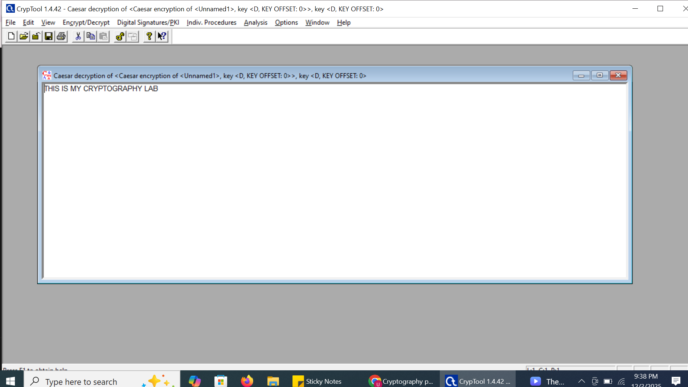
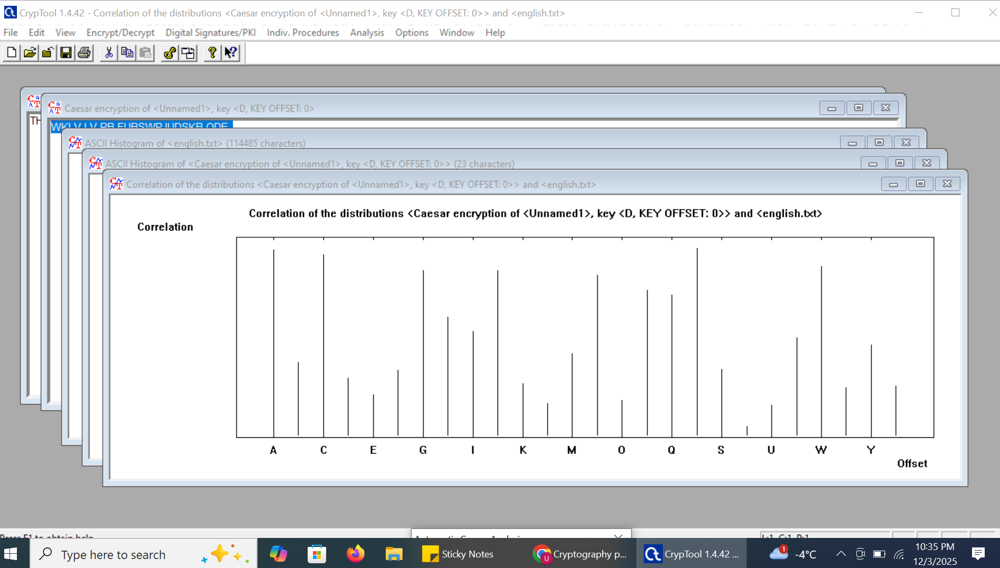
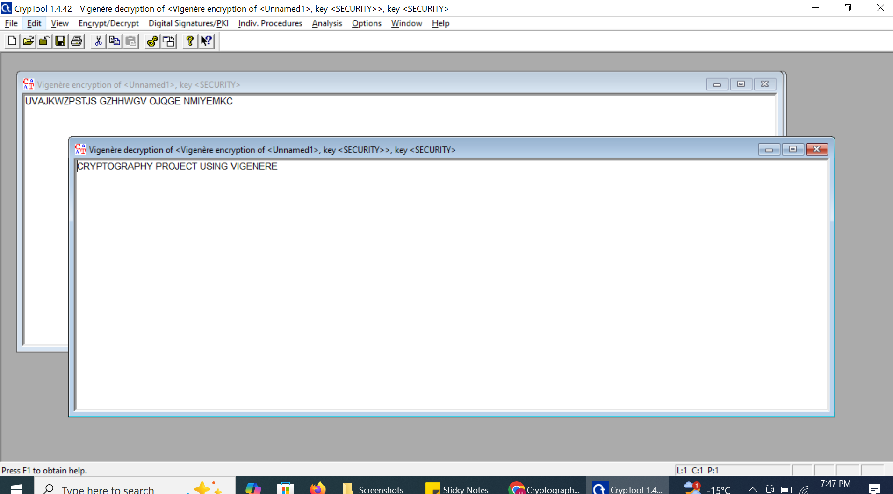
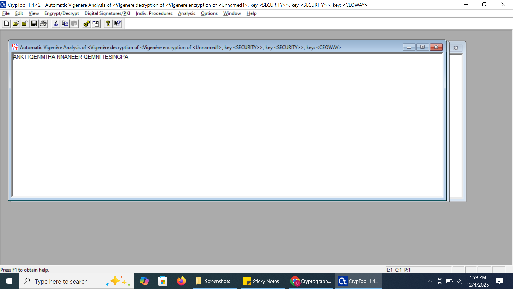
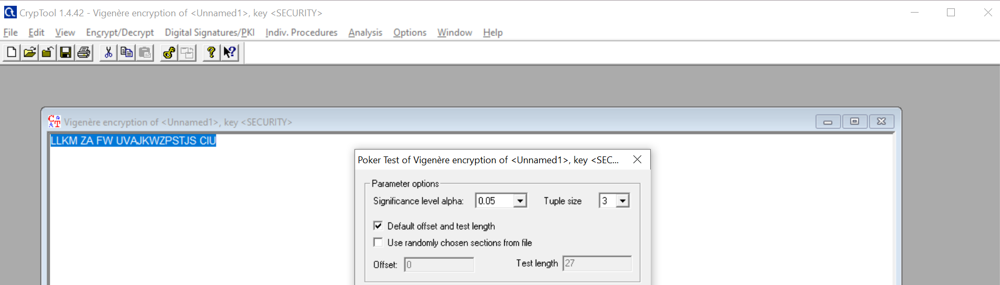

# Cryptography Lab – Caesar, Vigenère, RSA & Poker Test

**Author:** Umme Farva  

## Overview

This project demonstrates several foundational cryptographic techniques using CrypTool 1.4.42.  
The lab covers classical ciphers, modern public-key cryptography, and randomness testing used in security analysis.

### Techniques Covered
- **Caesar Cipher** – classical substitution cipher  
- **Vigenère Cipher** – polyalphabetic encryption  
- **RSA (1024-bit)** – modern public/private key cryptography  
- **Poker Test** – statistical randomness evaluation of ciphertext  

### What This Lab Shows
- How classical encryption works  
- How decryption and brute-force attacks succeed  
- How RSA keys are generated, used, and validated  
- How randomness tests reveal weaknesses in classical ciphers  
- How to document cybersecurity work clearly with screenshots  

All screenshots used in this project are stored in the **Screenshots/** folder.

---

# 1. Caesar Cipher

## **1.1 Encryption (Key = 3)**

**Plaintext:** 
THIS IS MY CRYPTOGRAPHY LAB

**Encryption Window:**  

**Ciphertext Output:**  

---

## **1.2 Decryption**
Recovered original plaintext.

---

## **1.3 Brute-Force Attack**
CrypTool tested all 25 shifts.

---

# 2. Vigenère Cipher

## **2.1 Encryption (Key = SECURITY)**

**Plaintext:**  
CRYPTOGRAPHY PROJECT USING VIGENERE

**Vigenère Encryption Window:**  

**Ciphertext Output:**  

---

## **2.2 Decryption**

---

## **2.3 Vigenère Key Analysis**

**CrypTool identifies:**

- possible key length  
- repeating patterns  
- correlation peaks  

**Analysis Window:**  

**Key Found:**  

---

# 3. RSA Public-Key Cryptography

## **3.1 RSA Key Generation (1024-bit)**

---

## **3.2 RSA Encryption**

**Plaintext:**
HELLO RSA

---

## **3.3 RSA Decryption**

---

# 4. Poker Test – Randomness Evaluation

Performed on Vigenère ciphertext.

**Graph Output:**  

**Summary (Score):**  

Result: **FAILED** — expected because classical ciphers are not random.

---

## Core Competencies

- Classical encryption methods (Caesar, Vigenère)  
- Public-key cryptography using RSA (1024-bit)  
- Cryptanalysis techniques and key-recovery concepts  
- Statistical randomness evaluation using the Poker Test  
- Documentation, reporting, and reproducible cybersecurity lab work  

---

## Final Overview

- This cryptography lab provides hands-on experience with both classical and modern encryption techniques using CrypTool.  
- It covers end-to-end workflow steps including encryption, decryption, key generation, ciphertext analysis, and randomness    testing — all supported with screenshots stored in the **Screenshots/** folder.

- The project is formatted for cybersecurity portfolios and academic submissions, demonstrating foundational cryptography      skills relevant to SOC analysis, threat intelligence, and secure system design.

---
